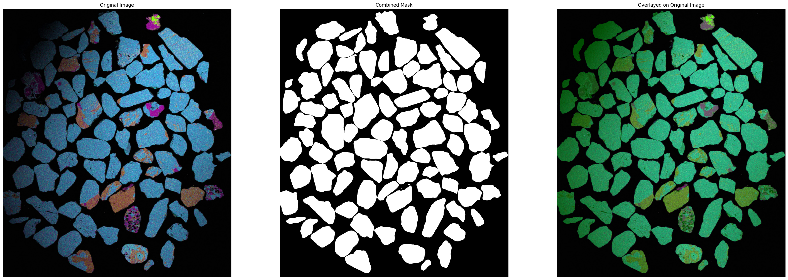
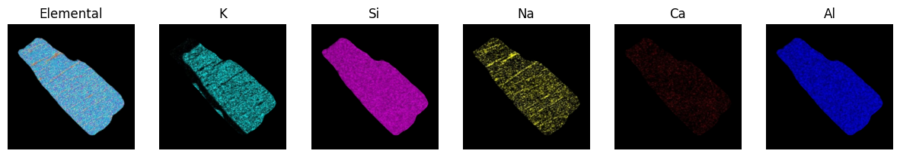
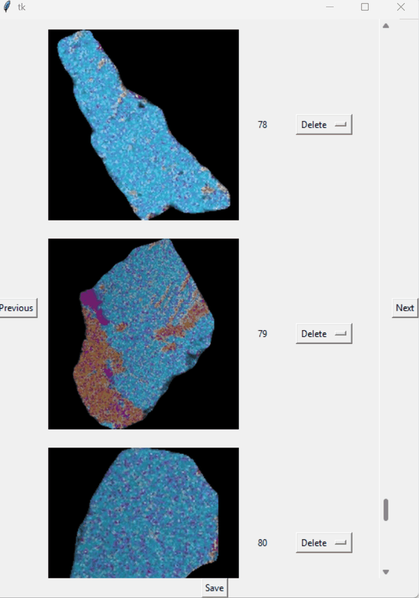

# Introduction
This project is an integrate pipeline for extracting mineral grains from SEM images and then use it to train a deep learning model for mineral grain classification.

The progress has been made in the following steps:
1. Align images with the same field of view but taken under different elements being illuminated (you may don't need if you only have one type of image per field of view. However, if you are using thin section images and want to work with PPL and XPL images together, then you may need to align them first. Sometimes there are some focus shift of the microscope which would cause trouble...so tried to take highest resolution possible to reduce the chance of that). 
2. Put the image you are going the segment in the folder `To_be_seg/` and then use  `segment-anything` model to segment mineral grains. You can take a look at how it looks right after the work of segment-anything model and then decide if you want to do some data cleaning. Sometimes even it looks right but actually doesn't (one grain got segmented into two parts, or two grains got segmented together, which can not be easily identified with raw eyes so we will run data checking and cleaning processes as well).

3. Visualize the segmented result and evaluate the following:
- Have all the grains been segmented? Any grains being left out? Any grains got segmented more than once or segmented incorrectly with other grains together?
- Are the segmented grains complete? Any grains being cut off?
Another visualization is to display different elementary images of the same grain together to observe what's the dominant element nicely and train the eyes to recognize the mineral type from the composite image (with all the illuminated elemental images stacked) together.

1. Clean the segmented results
2. A little tool to manually pick out grains of interest and calculate percentage in terms of pixel area
3. An interactive script to label the grains with a predefined mineral list, and prepare the dataset in the format that can be directly used for training a deep learning model. Please see a detailed readme here: [Interactive_Labeling_ReadMe](Interactive_Labeling_ReadMe.md)

  

7. Train a deep learning model for mineral grain classification using fast.ai (work in progress)

# Package requirements:
- python 3.10 (that's the version I am using, if you are using other versions, please be careful about the compatibility of different packages)
- segment-anything
- opencv-python
- d2l
- matplotlib
- numpy (matplotlib and opencv were compiled with NumPy 1.x and aren't compatible with NumPy 2.x., so probably need to be careful with the verrsion of numpy)
- pandas
- torch
- torchvision
- time
- datetime
- os